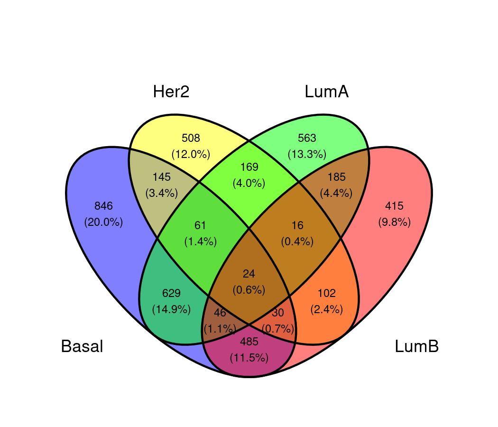
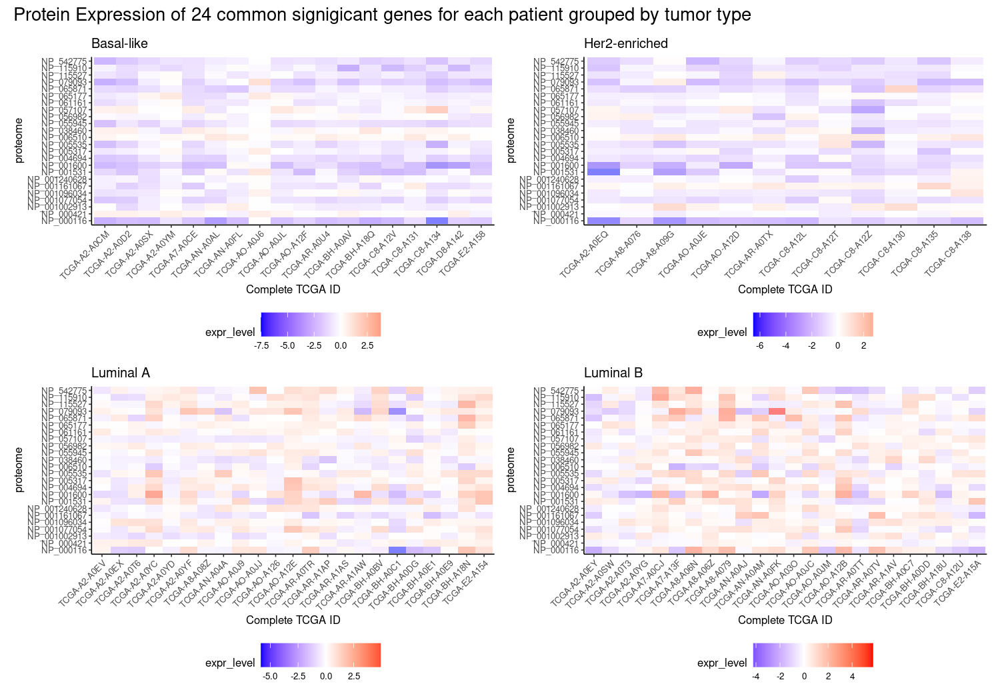
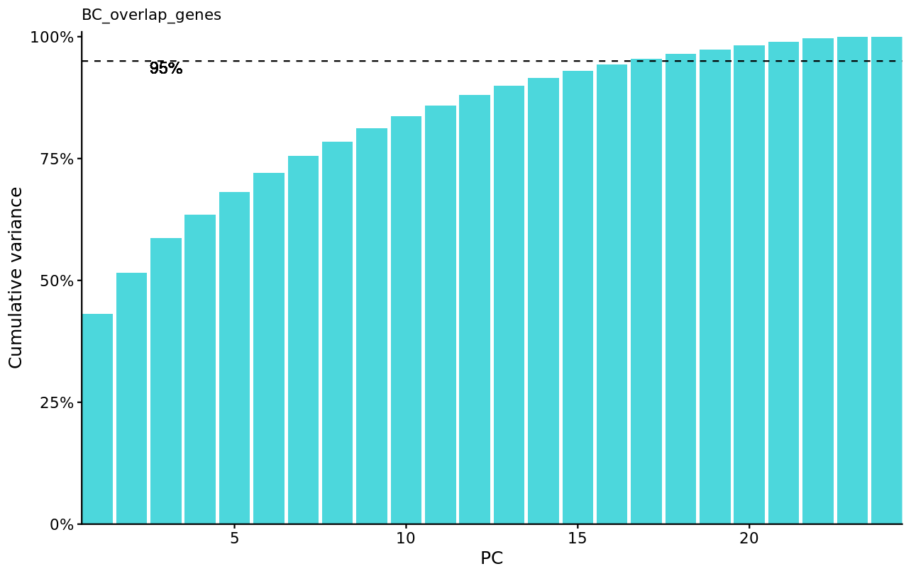
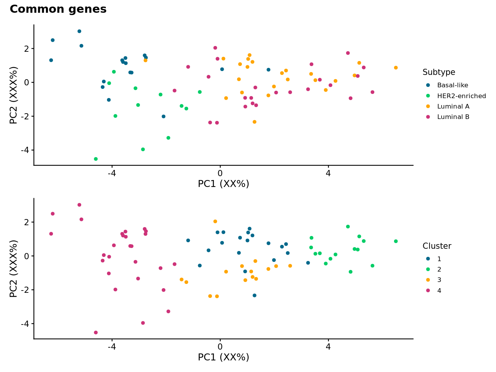
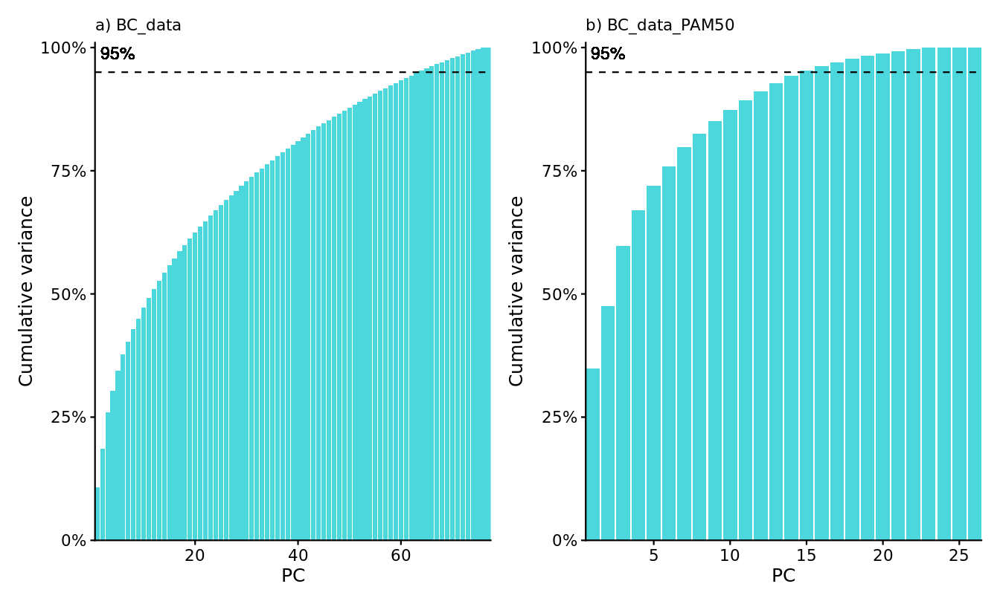
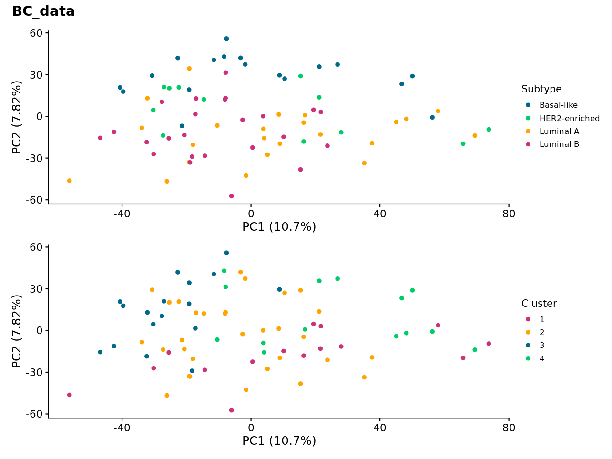
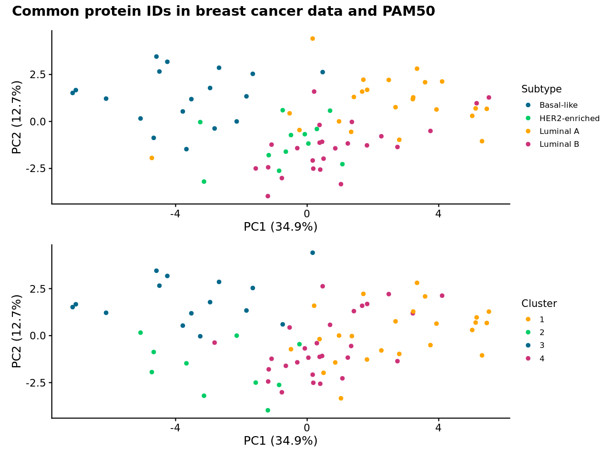

```{r setup, include=FALSE}
knitr::opts_chunk$set(echo = FALSE)
```

```{r include=FALSE}
library(tidyverse)
library(knitr)
```


## Contents

- Introduction
- Materials
- Methods  
- Results
- Discussion

## Introduction: Breast Cancer

Prevalence: 12% in women.

Mortality rate: 2,7%.

Symptoms: little to no before it is widespread

Tumor types: (Vary in location, size, shape and severity)

- Basal-like
- HER2-enriched
- Luminal A
- Luminal B


## Materials: Data

Data Origin

The raw datasets:

- 'patients': 105 cancer patients, 29 variables
- 'proteomes': protein expression of 12553 genes for 77 cancer patients, 3 duplicates and 3 healthy.
- 'PAM50': Describes each gene further


## Presenting Data

{width=99%}


## Methods: Data Modifications and analysis

{width=99%}


## Results: Common genes after GLM

{width=99%}

## Results: Gene expression profiling

{width=99%}

## Results:

{width=90%}

## Results: 1

{width=85%}

## Results: 2

{width=99%}

## Results: 2

{width=85%}

## Results: reduced version

{width=85%}

## Discussion

- Data lacks non cancer cases.


