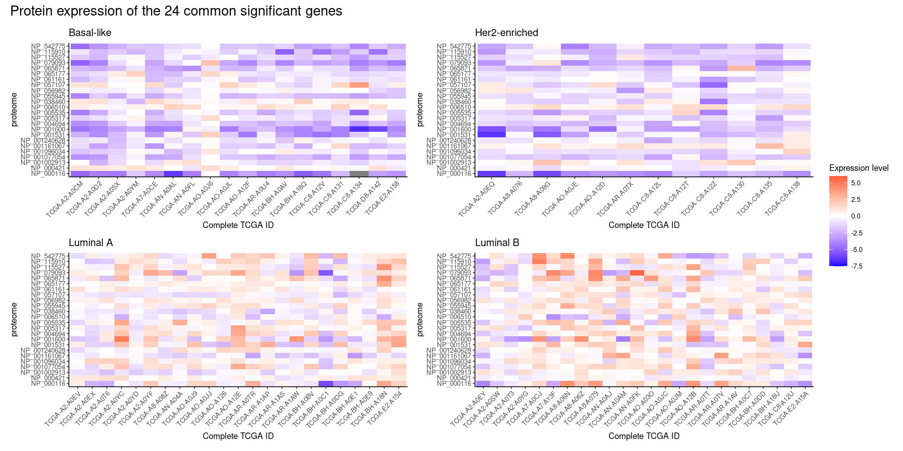

```{r setup, include=FALSE}
knitr::opts_chunk$set(echo = FALSE)
```

```{r include=FALSE}
library(tidyverse)
library(knitr)
```


## Contents

- Introduction
- Materials and Methods  
- Results
- Discussion

## Introduction: Breast Cancer

- Prevalence: 12% in women.
- Mortality rate: 2,7%.
- Symptoms: little to no before it is widespread
- 4 Tumor types: Vary in location, size, shape and severity

{width=99%}


## Aim

Breast cancer is found to have 4 subtypes at gene expression level and they can be detected by using a panel of 50 genes, namely the “PAM50”. In this project we will look at cancer patients with 4 subtypes, try to cluster the samples by using different sets of protein expression data, and evaluate the clustering results to see if the PAM50 gene list makes the most sense.

** take a look at later **

We are investigating whether the 4 subtypes can be detected and classified correctly by the gene expression Using the proteomic data. 


## Materials and Methods

{width=99%}

** take a look at **


## Results: Common proteins after GLM
- Still found 1000 more significant proteins in each subtype after `glm()`
- `ggvenn()`
- Only 24 significant proteins were founded in all 4 subtypes

{width=70%}

## Results: Common proteins after GLM
- LumA and B look more similar, while Basal and Her2 look more similar.
- Within each heat map, protein expression levels between each patient are also similar.

{width=85%}

## Results: Common Protein BC Data
- The first 17 PCs were chosen for clustering.
- Cluster distributions are not similar to subtype distributions.
- Accuracy: 16.9%

<right>
{width=82%}
</right>

## Results: Original BC data

{width=85%}

## Results: Common protein IDs between PAM50 and BC data

{width=99%}


## Discussion

- only half is explained by the clustering
- Data lacks non cancer cases.
- reproducability


