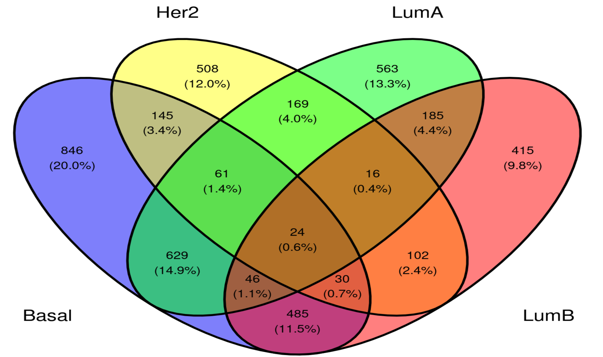
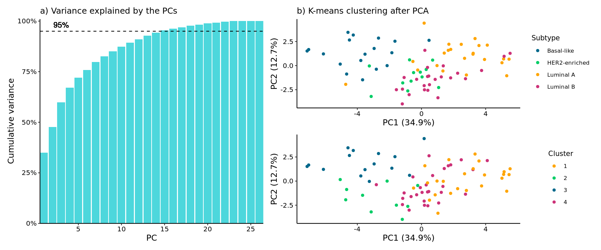

```{r setup, include=FALSE}
knitr::opts_chunk$set(echo = FALSE)
```

```{r include=FALSE}
library(tidyverse)
library(knitr)
```


## Contents

1. Introduction
2. Materials and Methods
   - <font size="4"> Work chart </font>
3. Results
   - <font size="4"> K-means clustering after PCA of common proteins after GLM </font>
   - <font size="4"> K-means clustering after PCA of full BC data </font>
   - <font size="4"> K-means clustering after PCA of Protein IDs common between PAM50 data and BC data </font>
4. Discussion

## Introduction

{width=99%}

- <font size="4"> Prevalence: 13% in women </font>
- <font size="4"> Mortality rate: 2.6% </font>
- <font size="4"> Symptoms: little to no before it is widespread </font>
- <font size="4"> 4 Tumor types: Vary in location, size, shape and severity </font>

<font size="1"> Cancer.org, "Key Statistics for Breast Cancer"  (2022). https://www.cancer.org/cancer/breast-cancer/about/how-common-is-breast-cancer.html </font>


## Aim

In this project we will investigate whether it is possible to detect and correctly classify the 4 breast cancer subtypes using different sets of protein expression data and compare the results of the classification.


## Materials and Methods

{width=99%}


<font size="1">Mertins, P., Mani, D., Ruggles, K. et al. Proteogenomics connects somatic mutations to signalling in breast cancer. Nature 534, 55–62 (2016). https://doi.org/10.1038/nature18003</font>


## Results - Common proteins after GLM

{width=70%}

- <font size="4"> Still found 1000 more significant proteins in each subtype after `glm()` </font>
- <font size="4"> `ggvenn()` </font>
- <font size="4"> Only 24 significant protein IDs common for all the 4 subtypes </font>


## Results - Common proteins after GLM

{width=99%}

- <font size="4"> Downregulated: Basal-like and HER2-enriched. </font>
- <font size="4"> Upregulated: Luminal-A and Luminal-B </font>
- <font size="4"> Similar protein expression levels between each patient within heat maps </font>

## Results - Common Protein BC Data

<right>
{width=99%}
</right>

- <font size="4"> The first 17 PCs were chosen for clustering </font>
- <font size="4"> Cluster distributions are not similar to subtype distributions </font>
- <font size="4"> Accuracy of plot: 16.9% </font>


## Results - Original BC data

{width=99%}

- <font size="4"> Number of PCA reduced from 77 to 65 </font>
- <font size="4"> No clear patterns </font>
- <font size="4"> Little of the variance is explained by PC1 and PC2 </font>
- <font size="4"> Accuracy of plot: 36.4% </font>


## Results - Protein IDs common between PAM50 data and BC data

{width=99%}

- <font size="4"> Number of PCA reduced from 26 to 15 </font>
- <font size="4"> 1st PC explains a much higher variance (34.9% compared to 10.7%) </font>
- <font size="4"> Accuracy of this exact plot: 48.1% </font>


## Discussion

- Best performer: PAM50
   - <font size="4"> Only 26 out of 100 protein IDs used </font>
- Only considering the common genes instead of e.g. the unique genes
- Improvements
   - <font size="4"> Cluster Luminal-A and Luminal-B together </font>
- Reproducible method


